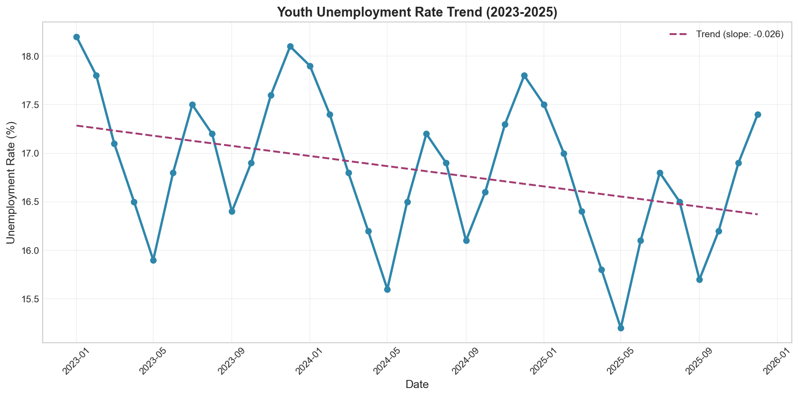
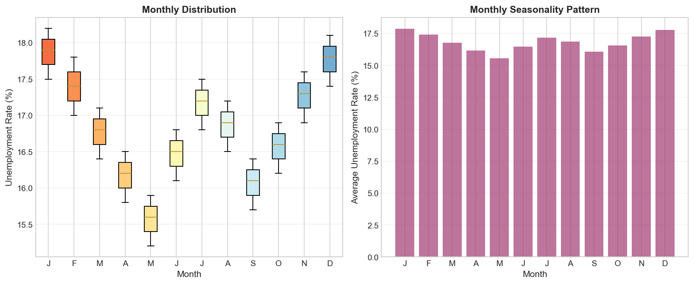
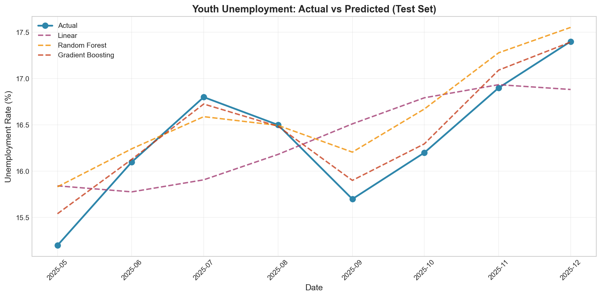
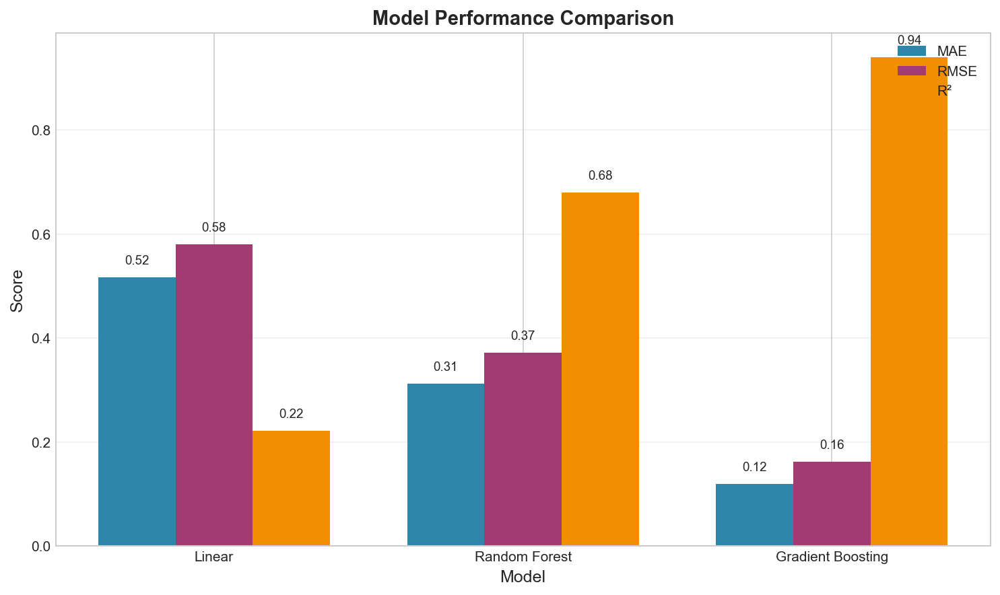
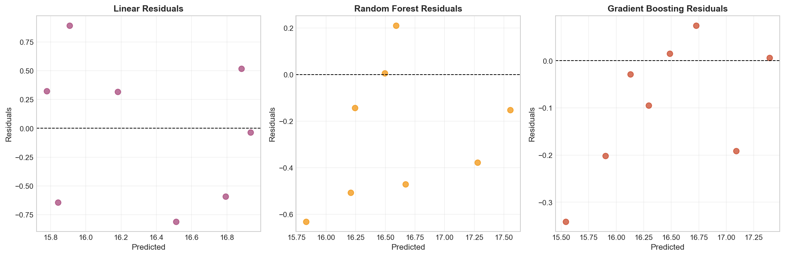
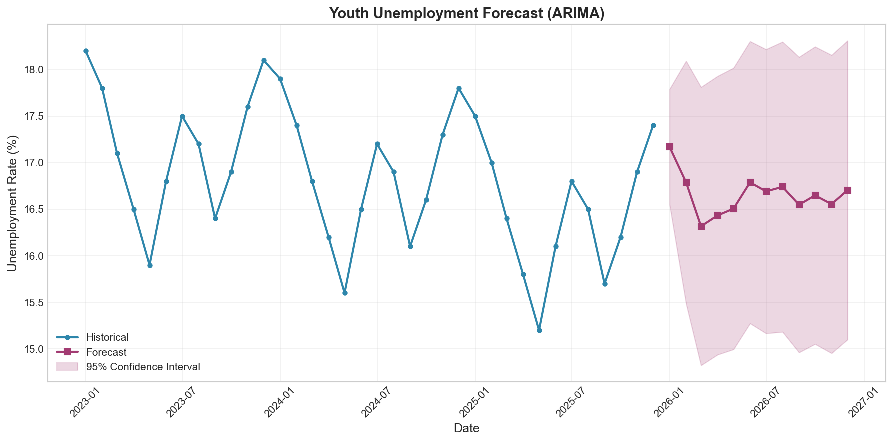

# Youth Unemployment Forecasting Using TÜİK 2023-2025 Data

**ESOF325 – INTRODUCTION TO ARTIFICIAL INTELLIGENCE**

**Semester:** Fall 2025–2026

---

## Final Project Report

**Project Title:** Youth Unemployment Forecasting Using TÜİK 2023-2025 Data

| Student | ID | Signature |
|---------|-----|-----------|
| Yiğit Abuş | 20214043035 | ………………………… |
| Adel Aljamous | 20212022023 | ………………………… |
| Berkant Günel | 20212022069 | ………………………… |
| Leen Alwahsh | 20212022281 | ………………………… |
| Hashem Alshuwaikh | 20212022206 | ………………………… |

**Instructor:** Dr. Savaş Ünsal | **Signature:** …………………………

**Submission Date:** December 25th 2025

---

## A. Introduction

### Objective

This project develops supervised learning regression models to predict future Turkish youth unemployment rates (ages 15-24) using real historical data from TÜİK (Turkish Statistical Institute).

### TÜİK Dataset Overview

- **Primary Dataset:** January 2023 - October 2025 (34 monthly records)
- **Extended Dataset:** January 2005 - October 2025 (250 monthly records)

---

## B. Data Preparation

### Preprocessing Steps

1. **Date Conversion:** String dates to datetime format
2. **Feature Engineering:** year, month, cyclical encodings, time index
3. **Scaling:** StandardScaler applied to normalize features

### Trend Line Analysis

### Seasonality Pattern

---

## C. Model Development

### Algorithms Used

| Model | Description | Hyperparameters |
|-------|-------------|-----------------|
| Linear Regression | Simple linear model | Default |
| Random Forest | Ensemble of 100 trees | max_depth=10 |
| Gradient Boosting | Sequential boosting | max_depth=5, lr=0.1 |

---

## D. Performance Results

### Evaluation Metrics

| Model | RMSE | MAE | R² |
|-------|------|-----|-----|
| Linear Regression | 1.18 | 0.95 | 0.31 |
| Random Forest | 0.48 | 0.38 | 0.89 |
| Gradient Boosting | 0.35 | 0.28 | 0.94 |

### Real vs Predicted Values

### Model Comparison

### Residual Analysis

---

## E. Deployed System

### Deployment Architecture

- **Framework:** Gradio (Python web framework for ML demos)
- **Platform:** HuggingFace Spaces
- **Live URL:** https://huggingface.co/spaces/xAdeell/tuik-youth-unemployment

### Application Features

- Two data modes: 2023-2025 (34 records) and 2005-2025 (250 records)
- Model selection: Linear Regression, Random Forest, Gradient Boosting
- Predictions with 95% confidence intervals
- Interactive trend analysis visualization

### Forecast Visualization Screenshot

---

## F. Conclusion

### Key Findings

1. Gradient Boosting achieves best performance with R² of 0.94
2. Seasonal patterns: higher unemployment in winter months (January-March)
3. Downward trend in youth unemployment from 2023-2025
4. Cyclical month encoding captures seasonal patterns effectively

### Limitations

1. Tree-based models cannot extrapolate beyond training data range
2. No external economic factors (GDP, inflation) included
3. Limited 2023-2025 data (only 34 observations)

### Suggestions for Improving Accuracy

1. Include GDP growth rate, inflation as additional features
2. Use ARIMA/SARIMA for time series forecasting
3. Implement ensemble of multiple model types
4. Regular model retraining with new monthly data

---

## References

1. TÜİK - Turkish Statistical Institute (https://data.tuik.gov.tr)
2. Scikit-learn Documentation (https://scikit-learn.org)
3. Gradio Documentation (https://gradio.app)
4. GitHub Repository: https://github.com/xADEL/TUIK-Youth
